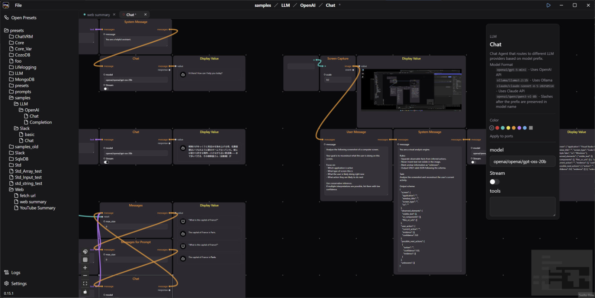

<div align="center">


<br>


<br>
<br>


[](../../LICENSE_APACHE-2.0)

</div>

モジュラーシンセのように AI ワークフローを組み上げる — 拡張可能なエージェントをビジュアルにパッチングし、リアルタイムに動き続けるパイプラインを構築。LLM、データベース、Web スクレイピング、メッセージングなど。プライバシーファースト、クラウド不要。

[English](README.md) | [日本語](README_ja.md)

<div align="center">

</div>

Modular Agent Desktop は [Modular Agent](../../README_ja.md) パッチのビジュアルエディタです。この README はアプリをビルド・拡張する開発者向けです。**使い方**は[ドキュメントサイト](https://modular-agent.github.io/docs/ja/)を参照してください: [インストール](https://modular-agent.github.io/docs/ja/getting-started/installation/)、[はじめてのパッチ](https://modular-agent.github.io/docs/ja/getting-started/first-patch/)、[Chat エージェントを使う](https://modular-agent.github.io/docs/ja/getting-started/chat-patch/)。

## 特徴

### エージェント

- ⚡ **ストリームベースのデータフロー** — エージェント間のリアルタイムデータストリーミング
- 🤖 **エージェントライブラリ** — LLM、Web/HTTP、メッセージング、データベース、スクリーンキャプチャなど。[全一覧](../../README_ja.md#エージェントライブラリ)を参照
- 🧩 **拡張可能** — Rust crate でエージェントパッケージを追加。[カスタムノード UI](#カスタムノード-ui) も定義可能

### ランタイム

- 🏠 **ローカル実行** — すべての処理はローカルマシン上で完結。クラウド不要
- 💻 **クロスプラットフォーム** — Windows、macOS、Linux
- 📦 **組み込み可能なコア** — ランタイム（[modular-agent-core](../../crates/modular-agent-core)）は独立した crate で、このアプリは [tauri-plugin-modular-agent](../../crates/tauri-plugin-modular-agent) 経由で組み込んでいる

### エディタ

- 🎨 **ビジュアルワークフローエディタ** — ノードベースのドラッグ＆ドロップでエージェントパイプラインを設計
- 🏃 **Run スイッチ** — タイトルバーまたはパッチ一覧からパッチを開始 / 停止（`Ctrl+.` / `Cmd+.`）。実行中のパッチはバックグラウンドで動き続ける
- 🗂️ **マルチタブ編集** — 開いているパッチごとにエディタが生存し、タブ切り替えは瞬時
- ↩️ **Undo / Redo** — ノード・接続・config の編集をカバーする Command パターンの履歴
- ⌨️ **カスタマイズ可能なショートカット** — すべてのホットキーを Settings で変更可能。よく使うエージェントを配置する Quick Add スロットも
- 💾 **パッチ管理** — 保存、フォルダ整理、JSON のインポート / エクスポート
- 🚀 **自動起動** — アプリ起動時に実行するパッチを設定可能
- 🔲 **システムトレイ** — ウィンドウを閉じてもワークフローを実行し続ける
- 🔌 **MCP サーバー** — 外部 AI エージェント（Claude Code など）がパッチをライブに参照・編集できる

## はじめに

> **開発者リリース** — ビルド済みバイナリはまだ提供されておらず、ソースからビルドします。[インストールガイド](https://modular-agent.github.io/docs/ja/getting-started/installation/)に同じ手順の詳しい説明があります。

### 前提条件

- [Rust](https://www.rust-lang.org/tools/install) とプラットフォーム固有の依存関係 — [Tauri prerequisites](https://v2.tauri.app/start/prerequisites/) を参照
- [Node.js](https://nodejs.org/)

### ビルド

monorepo のチェックアウト内の `apps/desktop` で:

```bash
npm install              # 依存パッケージのインストール
npm run tauri dev        # 開発モードで実行
npm run tauri build      # プロダクションビルド
```

Cargo の成果物はリポジトリルートの workspace 共通 `target/` に出力されます:

- **実行ファイル** — `target/release/modular-agent-desktop.exe`（Windows）/ `modular-agent-desktop`（macOS/Linux）
- **インストーラー** — `target/release/bundle/nsis/*-setup.exe`（Windows）/ `dmg/*.dmg`（macOS）/ `deb/*.deb`（Linux）

その他の npm スクリプト: `npm run check`（svelte-check）、`npm run format`（prettier）、`npm test`（vitest）。

## カスタムビルド (ma-config)

標準ビルドには in-tree のエージェント crate（[modular-agent-std](../../crates/modular-agent-std)、[modular-agent-llm](../../crates/modular-agent-llm)）が組み込まれています。さらに多くのエージェントパッケージ — Web スクレイピング、メッセージング、データベース、スクリーンキャプチャ、スクリプトエージェント — はビルド時に追加できます:

1. 使いたいエージェントリポジトリをリポジトリルートの `custom_agents/` に clone します。リポジトリ一覧は [custom_agents/README.md](../../custom_agents/README.md) を参照してください。
2. **ma-config** TUI ウィザードを実行し、エージェントと crate ごとの feature を選択します（clone 済みのエージェントだけが表示されます）:

   ```bash
   cargo run --manifest-path ../../tools/ma-config/Cargo.toml -- desktop
   ```

3. `npm run tauri dev` または `npm run tauri build` でリビルドします。

仕組み:

- ウィザードは `src-tauri/Cargo.toml` を更新し、`src-tauri/src/agents.rs` を再生成します（このファイルを手で編集しないこと）。in-tree エージェントは `{ workspace = true }`、out-of-tree エージェントは `path = "../../../custom_agents/<name>"` として出力され、各 clone が workspace のメンバーになります。
- 選択内容は `apps/desktop/ma-config.toml`（gitignored）に保存され、次回以降に再利用されます。`--apply` は対話ウィザードを経ずに、保存済みの選択からコード生成だけをやり直します。
- 各 out-of-tree パッケージは、リポジトリルートの `ma-registry.yaml` で自身を記述します — 説明、選択可能な Cargo feature、デフォルト、他パッケージとの conflict。workspace は全メンバー分の依存を一度に解決するため、conflict チェックは両アプリ（desktop と CLI）の選択の和集合に対して行われます。

## アーキテクチャ

- **フロントエンド** — [SvelteKit](https://svelte.dev/docs/kit/)（静的アダプタ）+ [Svelte 5](https://svelte.dev/)、[TypeScript](https://www.typescriptlang.org/)、[Tailwind CSS 4](https://tailwindcss.com/)、[Svelte Flow](https://svelteflow.dev/)、[shadcn-svelte](https://www.shadcn-svelte.com/)
- **バックエンド** — [Rust](https://www.rust-lang.org/) + [Tauri 2](https://v2.tauri.app/)
- **コア** — [modular-agent-core](../../crates/modular-agent-core) エージェントランタイム。[tauri-plugin-modular-agent](../../crates/tauri-plugin-modular-agent) 経由でアクセス

```text
src/                          # Svelte フロントエンド
  routes/
    patch_editor/             # エディタページシェル
    open_patches/             # パッチファイルブラウザ
    settings/                 # アプリ設定
    logs/                     # ログビューア
  lib/
    hotkeys.ts                # キーボードショートカットの定義とマッチング
    shared.svelte.ts          # グローバルなエージェントイベントバス
    tab-store.svelte.ts       # マルチタブ状態
    modular_agent.ts          # 低レベル Tauri invoke ラッパー
    components/
      patch-editor/           # エディタ内部
        context.svelte.ts     # EditorState: タブごとの状態 + 操作
        history.svelte.ts     # Command パターンの undo/redo
        editor-canvas.svelte  # Svelte Flow キャンバス、キーボードディスパッチ
        agent-node.svelte     # エージェントノードの描画
      agent-list/             # エージェントカテゴリツリーのポップアップ
      ui/                     # shadcn-svelte コンポーネント（生成物）
src-tauri/src/                # Rust バックエンド
  modular_agent_desktop/
    app.rs                    # パッチ管理状態 (ModularAgentApp)
    settings.rs               # Core 設定、エージェントのグローバル config
    observer.rs               # エンジンイベント → Tauri イベント
    tray.rs, window.rs, autostart.rs, shortcut.rs
```

### フロントエンド ↔ バックエンド

フロントエンドは Tauri の `invoke()`（`src/lib/modular_agent.ts` でラップ）で Rust コマンドを呼び、`tauri-plugin-modular-agent` を通じてエンジンに届きます。戻りの経路では `observer.rs` がエンジンの `ModularAgentEvent` を購読し、Tauri イベントとして中継します: エージェント単位のアクティビティが `ma:agent_config_updated`、`ma:agent_error`、`ma:agent_in`、`ma:agent_spec_updated`、パッチのライフサイクルが `ma:patch_list_changed`、`ma:patch_structure_changed`、`ma:patch_removed`、`ma:patch_renamed`、`ma:patch_running_changed`。すべてのペイロードは `origin`（`"desktop"`、`"mcp"` など）を持ち、フロントエンドは自身のエコーと外部からの編集を区別できます。

### エディタ内部

- 各タブは生存し続ける `EditorState`（`context.svelte.ts`）を持ちます。非アクティブなタブもマウントされたままイベントを受け取り続けるため、タブ切り替えは瞬時です。
- Undo/redo はコマンド履歴（`history.svelte.ts`）です。すべての編集は、実行・取り消し・バックエンドが割り当てた ID の再マップの方法を知る Command オブジェクトになっています。
- `shared.svelte.ts` はグローバルイベントバスで、どのタブが表示中かに関わらず Tauri リスナーがエージェント単位の状態を更新します。
- 外部からの編集（MCP エージェントや別ウィンドウ）は、開いているキャンバスに差分としてマージされます: origin によるセルフエコー除去 + `reconcileFlow` により、undo 履歴と選択状態は保たれます。

これらの仕組みの実装レベルの詳細は [CLAUDE.md](CLAUDE.md) に記載されています。

## ディスク上のパッチ

パッチは `~/.modular_agent/patches/` 配下の JSON ファイルです。フォルダ階層がパッチ名になり（`Music/Sampler` は `Music` フォルダ内の `Sampler`）、サイドバーはファイルシステムの変更をライブに追従します。個々のパッチファイルのインポート / エクスポートは File メニューから行います。

## 設定

- **Core 設定は変更時に自動保存**されます。唯一の例外はグローバルな「Show App Window」ショートカットで、アプリ再起動時にしか反映されないため手動の Save ボタンを持ちます。
- **キーボードショートカット** — エディタの全ホットキーを変更可能。Quick Add スロット（`mod+1`〜`mod+5`）はキーとエージェント種別の両方を割り当てられます。
- **自動起動** — アプリ起動時に実行するパッチを指定できます。
- **システムトレイ** — ウィンドウを閉じても、アプリと実行中のパッチはトレイで生き続けます。

## MCP サーバー

コアエンジンは内蔵 MCP サーバーを備えています（Settings → Core → MCP Server）。外部 AI エージェントはエージェント定義の参照、パッチの構築・編集、実行中フローの動作確認を行えます。有効化すると Bearer トークンが自動生成されます。Claude Code からの接続:

```bash
claude mcp add --transport http modular-agent http://127.0.0.1:8765/mcp \
    --header "Authorization: Bearer <token>"
```

サーバーは `127.0.0.1` のみにバインドし、MCP 経由の編集は開いているキャンバスにライブに反映されます。ツール一覧とセマンティクスは [core README](../../crates/modular-agent-core/README_ja.md#外部エージェントによる編集mcp-サーバー) を参照してください。

## カスタムノード UI

エージェントパッケージは [`@modular-agent/widget-kit`](widget-kit/README.md) を使って、デフォルトのノード描画を自前の Svelte 5 コンポーネントで置き換えられます:

- **NodeView** — 特定のエージェント種別のカスタムボディ
- **ConfigWidget** — config の値型ごとのカスタム入力
- **NodeStyle** — ノードフレームのプレゼンテーション上書き

UI パッケージはエージェントリポジトリ内の `ui/` npm パッケージとして配布され、ma-config の選択に基づいてビルド時に取り込まれます — 動的ロードやレジストリアクセスはありません。

## 関連

- [modular-agent-core](../../crates/modular-agent-core) — オーケストレーションエンジンとエージェントランタイム
- [tauri-plugin-modular-agent](../../crates/tauri-plugin-modular-agent) — このアプリの土台となる Tauri ブリッジ
- [`ma` CLI](../cli) — 同じパッチをヘッドレスで実行
- [エージェントライブラリ](../../README_ja.md#エージェントライブラリ) — パッケージの全一覧

## コントリビューション

- ⭐ **スターで応援する** — プロジェクトを広めるのに役立ちます
- 🤝 PR 歓迎 — [CONTRIBUTING.md](../../CONTRIBUTING.md) を参照

## ライセンス

このプロジェクトは [Apache License, Version 2.0](../../LICENSE_APACHE-2.0) の下でライセンスされています。
